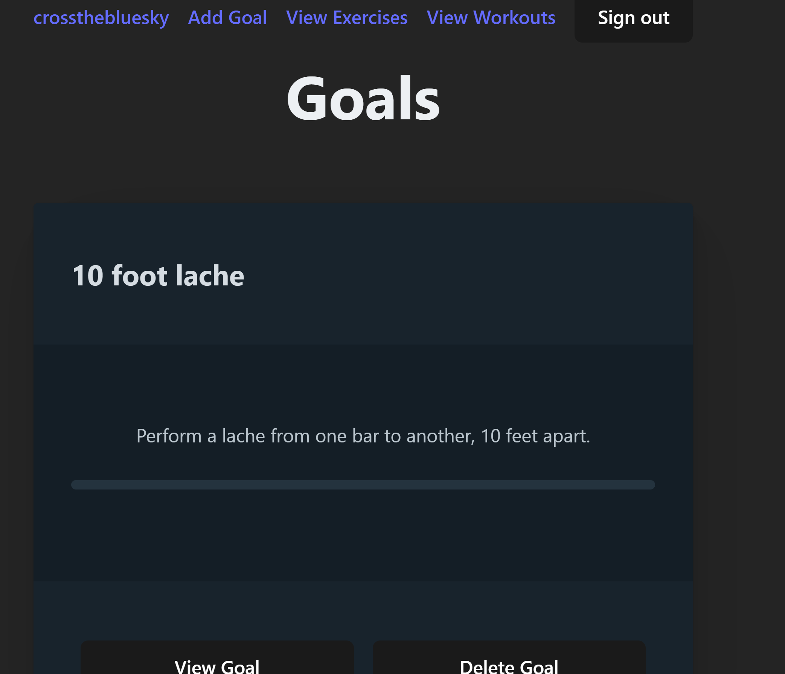
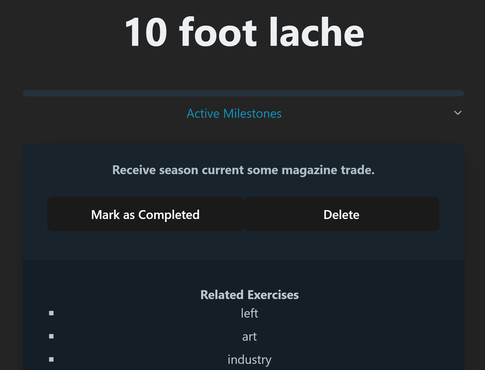
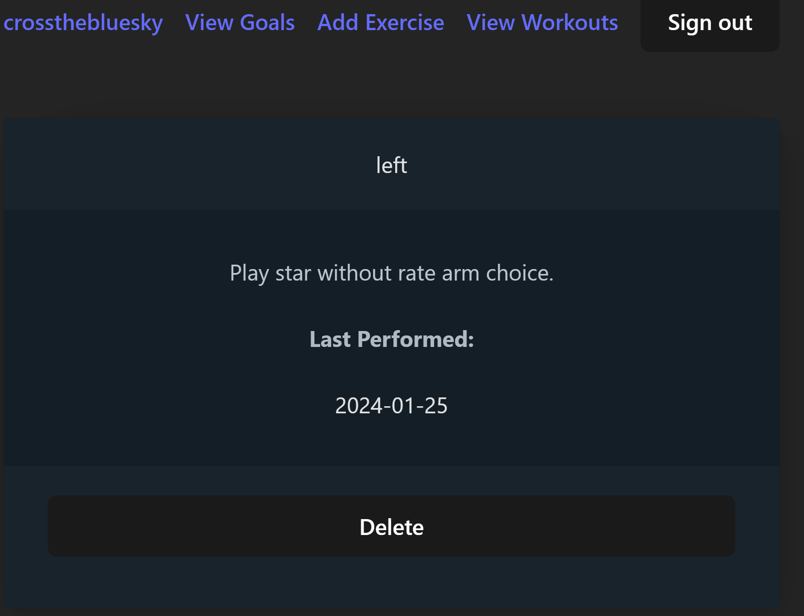
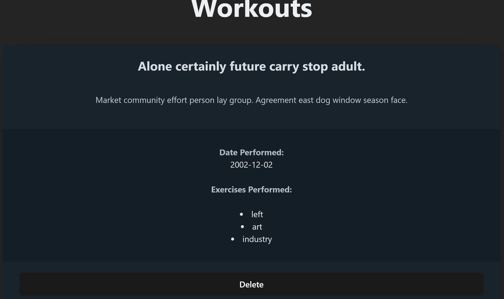

# Milestone-Fitness-App

## Description
Milestone Fitness App is a fitness and exercise tracking application designed to help users reach specific, discrete performance goals. Whether you're a beginner or a seasoned athlete, this app provides a platform to track your progress and stay motivated.

## Goal-Setting
Once logged in, you will be placed onto the Dashboard, which shows any goals you have already set, along with a progress bar visualizing how many of your established milestones for that goal have been reached. Clicking "Add Goal" from the dashboard will allow you to add a new goal, while clicking on the "View Goal" button on any of the listed goals will take you to an in-depth view of that goal's milestones

## Milestone Management
The core feature of the app is the ability to add a series of progressive "milestones" that lead towards the completion of your larger goals. Think of the goal "perform a 5 strict pullups." Some milestones that may be appropriate to this would be things like "Perform 10 barbell overhead presses of half of your bodyweight." The app doesn't decide on milestones for you, so doing your own research is required to establish reasonable progressions. In addition, each milestone can be associated with certain exercises. To use the pullup example again, you would certainly associate barbell presses to a milestone that focuses on them, but you can also associate exercises that work the same muscle group or stabilizers (rows and lat pulldowns, for example)

## Exercise Tracking
Exercises are tracked separately from Milestones, Goals, and Workouts. They are all added to the app by the user, and from there can be associated freely between the other aspects of the app. Since an exercise can take many forms, there is no infrastructure in place to standardize them. The user will need to describe whatever they consider relevant to the exercise in the Description section

## Workout Tracking
The workout tracking segment of the app is primarily meant as a way to keep track of what you've worked on recently, to help determine what you should be working on next. Since adding a workout updates any exercises performed during the workout, it helps keep track of which exercises you may have been neglecting.

